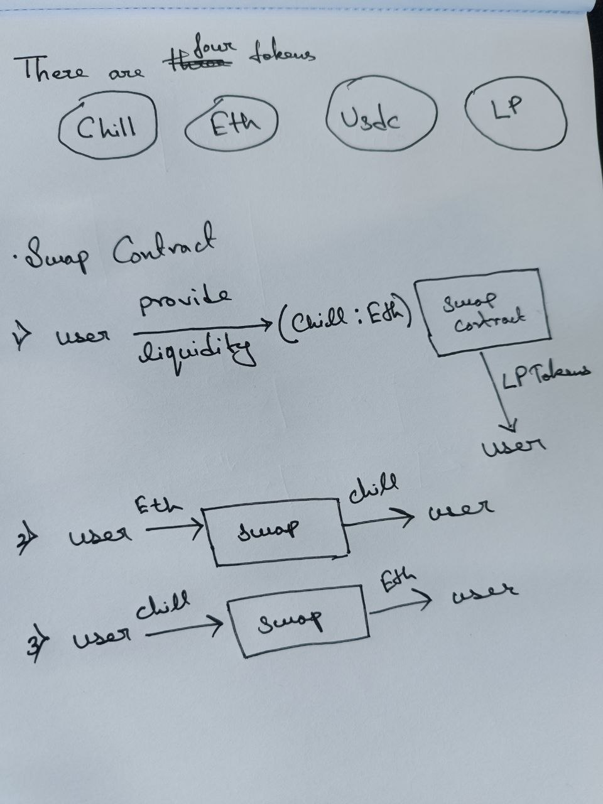
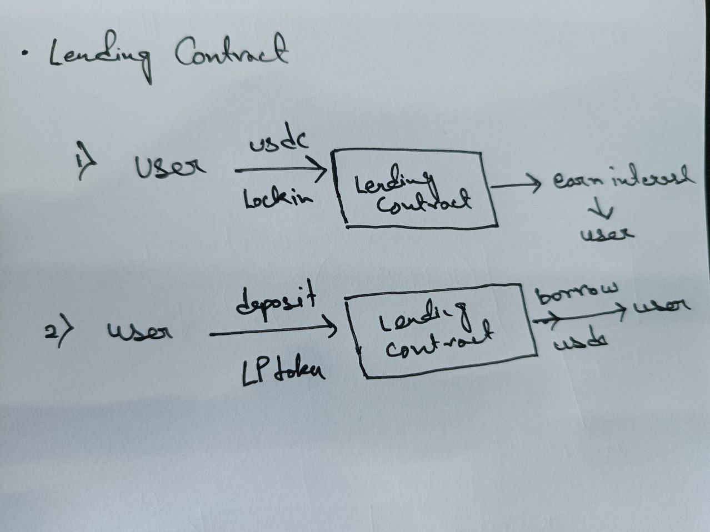

# **Token Swap and Lending System: Contract Deployment and Interaction Guide**

This guide walks you through the steps to deploy and interact with a series of smart contracts to perform token swaps and lending using ETH, USDC, and CHILL tokens. The system consists of three primary contracts:
1. **Token Contracts** (ETH, USDC, CHILL)
2. **SwapMaker Contract**
3. **Lending Contract**

## **Step 1: Deploying Token Contracts**

### **Deploy ETH Token Contract**
   - First, deploy the ETH token contract.
   - The contract will mint **1000 ETH tokens** to the deployer's address.

### **Deploy USDC Token Contract**
   - Deploy the USDC token contract next.
   - Similarly, mint **1000 USDC tokens** to the deployer's address.

### **Deploy CHILL Token Contract**
   - Deploy the CHILL token contract.
   - This will mint **1000 CHILL tokens** to the deployer's address.

## **Step 2: Deploying SwapMaker Contract**

### **Deploy the SwapMaker Contract**
   - Deploy the **SwapMaker** contract, passing the deployed **ETH** and **CHILL** token addresses as constructor parameters.
   - The **SwapMaker** contract allows swapping between these two tokens and adds liquidity functionality.

## **Step 3: Deploying Lending Contract**

### **Deploy Lending Contract**
   - Deploy the **Lending Contract**, passing the following parameters:
     - **SwapMaker Contract Address** (address of the deployed SwapMaker contract)
     - **LP Token Address** (LP token contract address generated by the SwapMaker contract)
     - **USDC Token Address** (address of the deployed USDC token contract)

## **Step 4: Setting Allowances for SwapMaker Contract**

### **Approve Tokens for SwapMaker Contract**
   - For the **SwapMaker** contract to interact with the **ETH** and **CHILL** token contracts, you need to approve allowances.
   - Call the `approve` function for both the ETH and CHILL token contracts, allowing the **SwapMaker** contract to spend tokens on your behalf:
   
   ```solidity
   // Example for ETH Token approval
   ethToken.approve(swapMakerContractAddress, amount);

   // Example for CHILL Token approval
   chillToken.approve(swapMakerContractAddress, amount);
   ```

## **Step 5: Adding Liquidity to SwapMaker Contract**

###  **Add Liquidity**
   - Now, you can deposit **ETH** and **CHILL** tokens into the **SwapMaker** contract to add liquidity.
   - Use the `addLiquidity` function in the **SwapMaker** contract. Upon successful deposit, the contract will mint LP tokens representing your liquidity share.
   
   ```solidity
   swapMakerContract.addLiquidity(ethAmount, chillAmount);
   ```

   - After the transaction, you will receive **LP tokens** as proof of your liquidity deposit.

## **Step 6: Approve LP Tokens and USDC for Lending Contract**

###  **Approve LP Token and USDC for Lending Contract**
   - To interact with the **Lending Contract**, approve the **LP tokens** and **USDC** token contract for the **Lending Contract** address.
   
   ```solidity
   // Example for LP Token approval
   lpToken.approve(lendingContractAddress, amount);

   // Example for USDC approval
   usdcToken.approve(lendingContractAddress, amount);
   ```

## **Step 7: Deposit USDC into Lending Contract**

### **Deposit USDC**
   - Deposit **USDC** tokens into the **Lending Contract** using the `deposit` function:
   
   ```solidity
   lendingContract.depositUSDC(usdcAmount);
   ```

## **Step 8: Deposit LP Tokens into Lending Contract**

### **Deposit LP Tokens**
   - Next, deposit your **LP tokens** into the **Lending Contract** using the `depositLP` function:
   
   ```solidity
   lendingContract.depositLP(lpTokenAmount);
   ```

## **Step 9: Borrow USDC from Lending Contract**

### **Borrow USDC**
   - After depositing LP tokens, you can now borrow **USDC** tokens from the **Lending Contract**. The amount you can borrow is determined by the contract's lending conditions.
   - Use the `borrow` function to initiate the borrowing process:
   
   ```solidity
   lendingContract.borrowUSDC(borrowAmount);
   ```

---

## **Conclusion**

This system allows you to:
- Swap between **ETH** and **CHILL** tokens.
- Provide liquidity and receive **LP tokens**.
- Deposit **USDC** and **LP tokens** into the **Lending Contract**.
- Borrow **USDC** from the **Lending Contract**.

## **Contract Architecture**




## **Script Callinge**

**Deploy All Tokens**
```forge script script/TokenDeploy.s.sol --rpc-url <write your rpc> --private-key <write your pk> --broadcast```
**Deploy Swap Contract**
```forge script script/SwapDeploy.s.sol --rpc-url <write your rpc> --private-key <write your pk> --broadcast```
**Provide Liquidty Pool for Swap**
```forge script script/ProvideLiquidity.s.sol --rpc-url <write your rpc> --private-key <write your pk> --broadcast```
**Deploy Lending Contract**
```forge script script/LendingDeploy.s.sol --rpc-url <write your rpc> --private-key <write your pk> --broadcast```
**Deposit USDC in Loan pool**
```forge script script/DepositLP.s.sol --rpc-url <write your rpc> --private-key <write your pk> --broadcast```
**Deposit LP token and take USDC as loan**
```forge script script/Borrow.s.sol --rpc-url <write your rpc> --private-key <write your pk> --broadcast```


## **Contract Addresses**

**Base:**
ChillToken Contract deployed at: https://sepolia.basescan.org/address/0x53D15c8369a17F163c28C8A51c2fEea4ac30a379
EthToken Contract deployed at: https://sepolia.basescan.org/address/0xa9Bbb36CD26bcBE034E1C4e0619bfA6f0eEc48C2
UsdcToken Contract deployed at: https://sepolia.basescan.org/address/0xfff254d049675E5377eF9f137B8BBE720dB1bF25
SwapContractWithYield deployed at: https://sepolia.basescan.org/address/0x28C62F8404C003853f633767c43acF4529aeD48A
Lending Contract deployed at: https://sepolia.basescan.org/address/0xB8107AE3F080a8bc612B342cC839dF25bEC2e963

**Citra:**
ChillToken Contract deployed at: https://explorer.testnet.citrea.xyz/address/0x73e8E00646e7DE7f135AAE385A2102fd1637d59e
EthToken Contract deployed at: https://explorer.testnet.citrea.xyz/address/0x58CCF12593D608D871EF447d3fEC9D00f35E14E2
UsdcToken Contract deployed at: https://explorer.testnet.citrea.xyz/address/0xbe5d45A7c0709BAb9e51337c991daBCB97c6d1eF
SwapContractWithYield deployed at: https://explorer.testnet.citrea.xyz/address/0xe71EAE89Dd7B325d5998C82D48d71Ff7A4c8E322
Lending Contract deployed at: https://explorer.testnet.citrea.xyz/address/0xac77B823b58873572937a01b3E0CB9C417Cf637E

**Polygon:**
ChillToken Contract deployed at: https://amoy.polygonscan.com/address/0x41007C72d52D5389a135e993af1D6A02761595bE
EthToken Contract deployed at: https://amoy.polygonscan.com/address/0x944eC8CD3CdA1D2abD311bd942421E7D5Bd998F1
UsdcToken Contract deployed at: https://amoy.polygonscan.com/address/0x1eA3b9fc2ACFAB2Ee16F7515727999C52A8F9B7E
SwapContractWithYield deployed at: https://amoy.polygonscan.com/address/0x36bE7bD5550DD5A1B56f8D34Cf3A20b2E2E657C0
Lending Contract deployed at: https://amoy.polygonscan.com/address/0x73e8E00646e7DE7f135AAE385A2102fd1637d59e

**Binance Smart Chain:**
ChillToken Contract deployed at: https://opbnb-testnet.bscscan.com/address/0x41007C72d52D5389a135e993af1D6A02761595bE
EthToken Contract deployed at: https://opbnb-testnet.bscscan.com/address/0x944eC8CD3CdA1D2abD311bd942421E7D5Bd998F1
UsdcToken Contract deployed at: https://opbnb-testnet.bscscan.com/address/0x1eA3b9fc2ACFAB2Ee16F7515727999C52A8F9B7E
SwapContractWithYield deployed at: https://opbnb-testnet.bscscan.com/address/0x36bE7bD5550DD5A1B56f8D34Cf3A20b2E2E657C0
Lending Contract deployed at: https://opbnb-testnet.bscscan.com/address/0xe71EAE89Dd7B325d5998C82D48d71Ff7A4c8E322

**Pokadot MoonBeam**
ChillToken Contract deployed at: https://moonbase.moonscan.io/address/
EthToken Contract deployed at: https://moonbase.moonscan.io/address/
UsdcToken Contract deployed at: https://moonbase.moonscan.io/address/
SwapContractWithYield deployed at: https://moonbase.moonscan.io/address/
Lending Contract deployed at: https://moonbase.moonscan.io/address/
